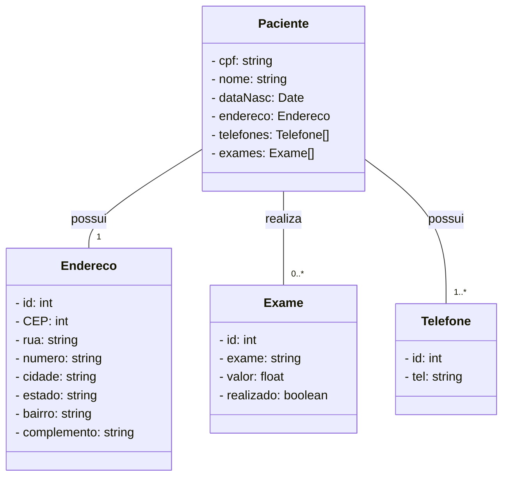

# Projeto de cadastro de pacientes de uma clínica em RestFul API

## Tecnologias utilizadas
* Java 17 LTS
* Swagger OpenAPI
* OpenFeign
* Spring boot
* JPA
* Conector PostgreSQL

## Link do projeto rodando no Railway
https://clinica-production-6136.up.railway.app/swagger-ui/index.html

## Diagrama de classes

