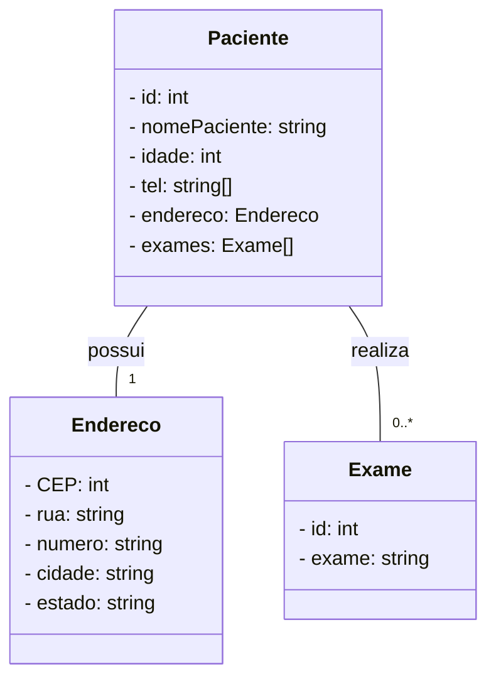

# Projeto de cadastro de pacientes de uma clínica

## Diagrama de classes

```mermaid
classDiagram
    class Paciente {
        - id: int
        - nomePaciente: string
        - idade: int
        - tel: string[]
        - endereco: Endereco
        - exames: Exame[]
    }

    class Endereco {
        - CEP: int
        - rua: string
        - numero: string
        - cidade: string
        - estado: string
    }

    class Exame {
        - id: int
        - exame: string
    }

    Paciente -- "1" Endereco : possui
    Paciente -- "0..*" Exame : realiza
```