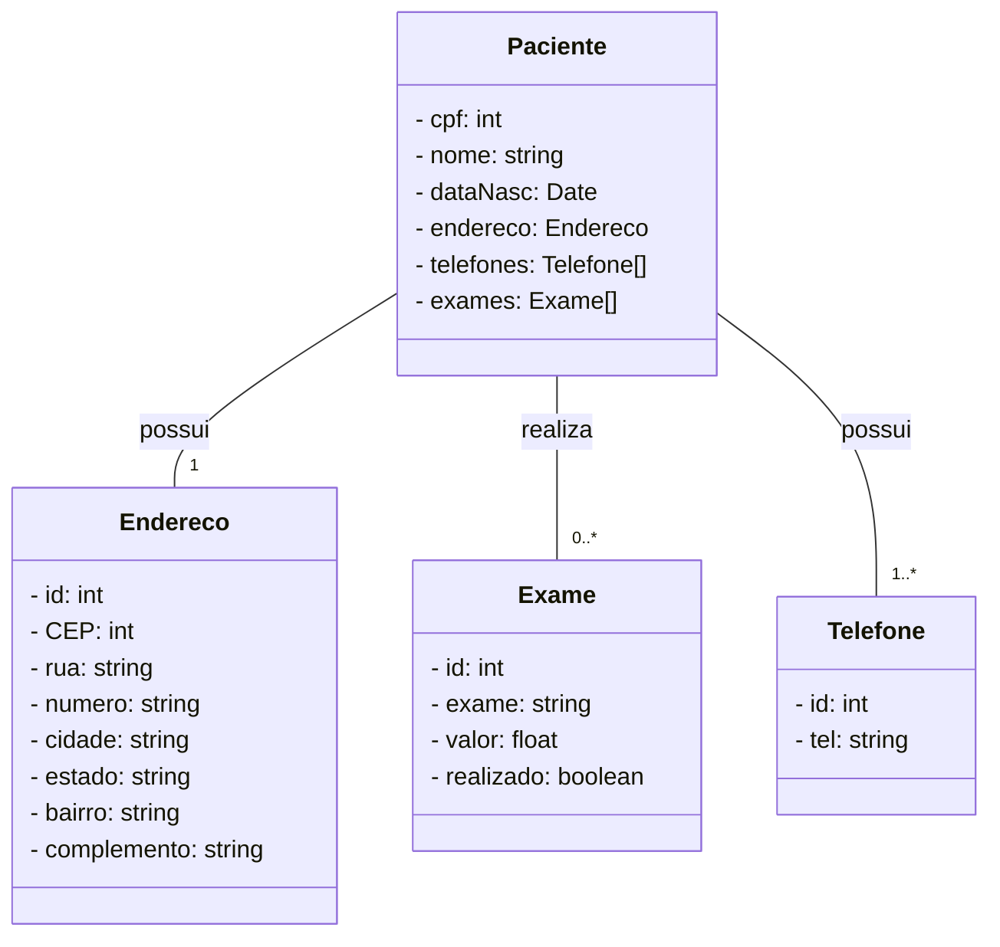

# Projeto de cadastro de pacientes de uma clínica

## Diagrama de classes

```mermaid
classDiagram
    class Paciente {
        - cpf: int
        - nome: string
        - dataNasc: Date
        - endereco: Endereco
        - telefones: Telefone[]
        - exames: Exame[]
    }

    class Telefone {
        - id: int
        - tel: string
    }

    class Endereco {
        - id: int
        - CEP: int
        - rua: string
        - numero: string
        - cidade: string
        - estado: string
        - bairro: string
        - complemento: string
    }

    class Exame {
        - id: int
        - exame: string
        - valor: float
        - realizado: boolean
    }

    Paciente -- "1" Endereco : possui
    Paciente -- "0..*" Exame : realiza
    Paciente -- "1..*" Telefone : possui
```